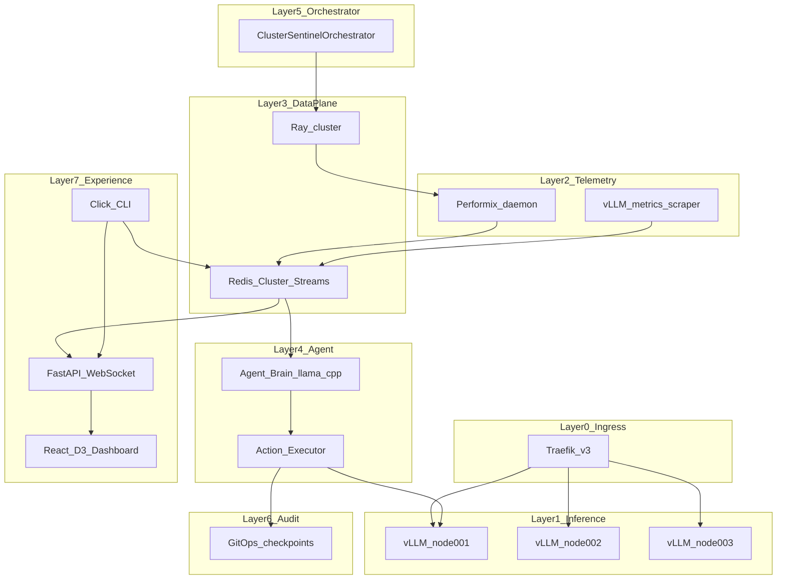
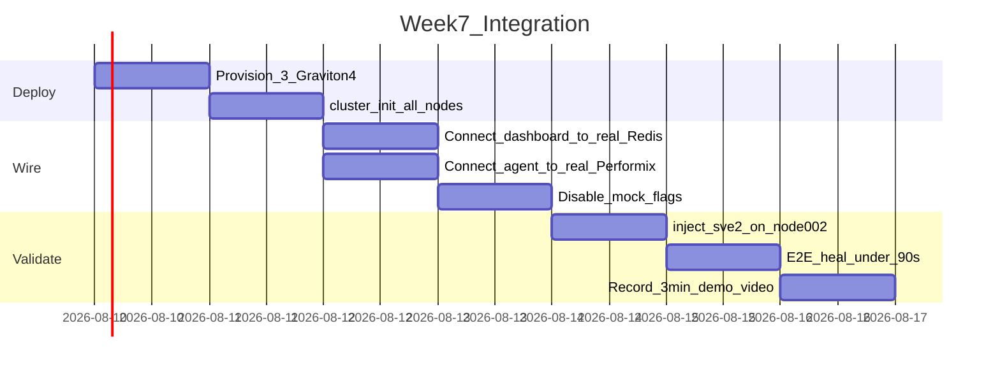

# NeoSentinel v2.0 — End-to-End Build Roadmap

**Context:** Repo at [`C:\Users\kumar\OneDrive\Desktop\NeoSentinel`](C:\Users\kumar\OneDrive\Desktop\NeoSentinel). **Week 0 in progress** — scaffold, contracts, CI, and provisioning doc done; Graviton4 instances not yet provisioned. Target: production-grade demo on **3× AWS Graviton4 (c8g.4xlarge)** with **tests at every step**.

**Parallel-work rule:** Sahil and Divyansh never block each other during Weeks 1–6. They integrate only in Week 7 using pre-agreed contracts in [`neosentinel/contracts/`](neosentinel/contracts/).

### Progress at a glance

| Week | Status | Done |
| ---- | ------ | ---- |
| Week 0 | 🔄 In progress | 16/17 deliverables |
| Week 1 | ⬜ Not started | 0/10 |
| Week 2 | ⬜ Not started | 0/10 |
| Week 3 | ⬜ Not started | 0/10 |
| Week 4 | ⬜ Not started | 0/11 |
| Week 5 | ⬜ Not started | 0/11 |
| Week 6 | ⬜ Not started | 0/10 |
| Week 7 | ⬜ Not started | 0/10 |

---

## Architecture Overview



---

## Ownership Split (Zero Cross-Dependency Weeks 1–6)

| Track                          | Owner        | Owns                                                                                    | Mock Strategy                                                           |
| ------------------------------ | ------------ | --------------------------------------------------------------------------------------- | ----------------------------------------------------------------------- |
| **Data & Intelligence Plane**  | **Sahil**    | Docker infra, Performix, Redis Streams, Ray, agent brain, actions, orchestrator, GitOps | Tests use in-memory Redis + fake Performix; no dashboard needed         |
| **Control & Experience Plane** | **Divyansh** | CLI, FastAPI/WebSocket, React UI, simulation player, SDK API, PyPI/CI, docs             | Tests use fixture JSON + mock WebSocket publisher; no real agent needed |

**Shared boundary (Week 0 only):** Both approve frozen contracts — no implementation dependency after that.

---

## Week 0 — Foundation & Contracts (Both, 3 days) 🔄

Joint deliverables before parallel work begins:

1. **Repo scaffold**
   - [x] [`pyproject.toml`](pyproject.toml) — Python 3.12, package name `neosentinel`, dev deps (`pytest`, `hypothesis`, `ruff`)
   - [x] [`LICENSE`](LICENSE) — Apache 2.0
   - [x] [`.github/workflows/ci.yml`](.github/workflows/ci.yml) — lint + test skeleton (Divyansh leads, Sahil reviews)
   - [x] [`.gitignore`](.gitignore) — Python, tooling caches, secrets, IDE
   - [x] [`README.md`](README.md) — Week 0 status + dev instructions
   - [x] Directory layout per spec (empty `__init__.py` files OK)

2. **Frozen contracts** in [`neosentinel/contracts/`](neosentinel/contracts/) (both sign off):
   - [x] `telemetry.py` — `TelemetrySnapshot`, `NodeSnapshot`, `BaselineMetrics`
   - [x] `decision.py` — `SentinelDecision`, `ActionType` (7 enum values)
   - [x] `streams.py` — Redis stream names, field schemas for all 4 streams
   - [x] `websocket.py` — dashboard event types (`metrics`, `agent_thought`, `healing`, `audit`, `flame_graph`)
   - [x] `openapi.yaml` — dashboard REST + WS endpoints
   - [x] `tests/unit/test_contracts.py` — 27 contract validation tests

3. **3-node infra provisioning doc** (Sahil writes, both use):
   - [x] [`docs/infra/aws-3-node-provisioning.md`](docs/infra/aws-3-node-provisioning.md) — AWS EC2 checklist: 3× c8g.4xlarge, Ubuntu 24.04 ARM64, security group ports (22, 8000, 8080, 6379, 7000, 10001)
   - [x] SSH key setup, node naming (`node-001`, `node-002`, `node-003`)

**Exit criteria:**
- [x] CI runs green on empty package (27 tests pass, ruff clean)
- [x] Contract files merged
- [ ] 3 Graviton4 instances reachable via SSH

---

## Week 1 — Infrastructure & Shell UX ⬜

### Sahil — Docker & Telemetry Sensors

| Task                          | Deliverables                                                                                                                                                                                                     | Tests                                                                              |
| ----------------------------- | ---------------------------------------------------------------------------------------------------------------------------------------------------------------------------------------------------------------- | ---------------------------------------------------------------------------------- |
| [ ] S1.1 Docker Compose stack     | [`docker/docker-compose.yml`](docker/docker-compose.yml), per-service dirs: [`docker/traefik/`](docker/traefik/), [`docker/vllm/`](docker/vllm/), [`docker/redis/`](docker/redis/), [`docker/ray/`](docker/ray/) | `tests/integration/test_compose_health.py` — services start, `/health` returns 200 |
| [ ] S1.2 Traefik L7 config        | Round-robin, health checks 10s, circuit breaker >50% errors, rate limit 1000 req/min                                                                                                                             | `tests/unit/test_traefik_config.py` — config validation                            |
| [ ] S1.3 vLLM worker template     | Llama 3.2 7B INT4, `/metrics` + `/v1/completions`, KleidiAI build flags documented                                                                                                                               | `tests/integration/test_vllm_endpoint.py` — completion + metrics scrape            |
| [ ] S1.4 Performix daemon wrapper | [`neosentinel/telemetry/performix.py`](neosentinel/telemetry/performix.py) — 1Hz PMU collection (SVE2, DRAM BW, cache miss, hotspots)                                                                            | `tests/unit/test_performix_parser.py` — parse sample `apx` output                  |
| [ ] S1.5 Mock Performix for dev   | [`neosentinel/telemetry/mock_performix.py`](neosentinel/telemetry/mock_performix.py) — generates contract-valid PMU frames                                                                                       | `tests/unit/test_mock_performix.py`                                                |

### Divyansh — CLI Bootstrap & Dashboard Skeleton

| Task                          | Deliverables                                                                                                                                                                   | Tests                                                  |
| ----------------------------- | ------------------------------------------------------------------------------------------------------------------------------------------------------------------------------ | ------------------------------------------------------ |
| [x] D1.1 Click CLI skeleton       | [`neosentinel/cli/main.py`](neosentinel/cli/main.py) — `init`, `cluster-init`, `start`, `doctor` command stubs                                                                 | `tests/cli/test_cli_help.py` — all commands registered |
| [x] D1.2 FastAPI dashboard server | [`neosentinel/dashboard/server.py`](neosentinel/dashboard/server.py) — health route, WS endpoint stub on `:8080`                                                               | `tests/dashboard/test_server_health.py`                |
| [x] D1.3 React app bootstrap      | [`dashboard-ui/`](dashboard-ui/) — Vite + React + TypeScript + Tailwind, WebSocket client hook                                                                                 | `dashboard-ui/src/__tests__/App.test.tsx`              |
| [x] D1.4 Mock telemetry feed      | [`neosentinel/dashboard/mock_feed.py`](neosentinel/dashboard/mock_feed.py) — emits contract-valid WS events from JSON fixtures in [`scenarios/fixtures/`](scenarios/fixtures/) | `tests/dashboard/test_mock_feed.py`                    |
| [x] D1.5 Auto-open browser        | Hook in `start` command stub — opens `http://localhost:8080`                                                                                                                   | `tests/cli/test_browser_open.py` (mock `webbrowser`)   |

**Week 1 exit:** `docker compose up` runs 3 vLLM backends + Traefik on one node; dashboard loads with mock data; CI green.

---

## Week 2 — Data Pipeline & Live UI Panels ⬜

### Sahil — Redis Streams & Metrics Scraper

| Task                      | Deliverables                                                                                                                   | Tests                                                                    |
| ------------------------- | ------------------------------------------------------------------------------------------------------------------------------ | ------------------------------------------------------------------------ |
| [ ] S2.1 Redis Cluster config | 3-shard cluster in Compose, cross-node replication                                                                             | `tests/integration/test_redis_cluster.py` — slot coverage, failover      |
| [ ] S2.2 Telemetry pipeline   | [`neosentinel/distributed/streams.py`](neosentinel/distributed/streams.py) — `TelemetryPipeline` with XADD/XREAD/XACK          | `tests/unit/test_streams_xack.py` — at-least-once delivery               |
| [ ] S2.3 Four streams         | `neosentinel:telemetry:pmu`, `:vllm`, `:decisions`, `:healing` + consumer groups                                               | `tests/integration/test_stream_retention.py` — 24hr TTL                  |
| [ ] S2.4 vLLM metrics scraper | [`neosentinel/telemetry/vllm_scraper.py`](neosentinel/telemetry/vllm_scraper.py) — TTFT, tokens/sec, KV eviction (5s interval) | `tests/unit/test_vllm_scraper.py`                                        |
| [ ] S2.5 Pipeline integration | Performix + scraper → Redis at 1Hz/5s                                                                                          | `tests/integration/test_pipeline_e2e.py` — in-memory Redis, no dashboard |

### Divyansh — Dashboard Core Panels

| Task                          | Deliverables                                                                                                                 | Tests                                               |
| ----------------------------- | ---------------------------------------------------------------------------------------------------------------------------- | --------------------------------------------------- |
| [x] D2.1 Cluster status panel     | 3-node green/yellow/red cards, requests/min                                                                                  | `dashboard-ui/src/__tests__/ClusterStatus.test.tsx` |
| [x] D2.2 Real-time metrics gauges | TTFT P99, tokens/sec, SVE2 %, DRAM BW % per node                                                                             | `dashboard-ui/src/__tests__/MetricsGauges.test.tsx` |
| [x] D2.3 WebSocket broadcaster    | [`neosentinel/dashboard/broadcaster.py`](neosentinel/dashboard/broadcaster.py) — reads from mock feed OR Redis (config flag) | `tests/dashboard/test_broadcaster.py`               |
| [x] D2.4 WS → React wiring        | Live updates <50ms target (measure in test with mock)                                                                        | `tests/dashboard/test_ws_latency.py`                |
| [x] D2.5 Layout shell             | Full dashboard grid matching spec ASCII mockup                                                                               | Visual snapshot test optional                       |

**Week 2 exit:** Sahil's pipeline fills Redis on a single node; Divyansh's dashboard renders live mock stream; both test suites independent.

---

## Week 3 — Agent Brain & Agent UX ⬜

### Sahil — Decision Engine

| Task                            | Deliverables                                                                                             | Tests                                                                                    |
| ------------------------------- | -------------------------------------------------------------------------------------------------------- | ---------------------------------------------------------------------------------------- |
| [ ] S3.1 Pydantic schemas impl      | [`neosentinel/schemas/`](neosentinel/schemas/) — full `SentinelDecision`, grammar JSON schema export     | `tests/unit/test_schema_validation.py` — 100% valid/invalid cases                        |
| [ ] S3.2 llama.cpp agent runtime    | [`neosentinel/agent/brain.py`](neosentinel/agent/brain.py) — Llama 3.2 3B INT4, KleidiAI, <5% CPU budget | `tests/unit/test_brain_mock_llm.py` — mock llama.cpp responses                           |
| [ ] S3.3 Grammar-constrained decode | instructor + llama.cpp grammar mode — impossible action types rejected                                   | `tests/unit/test_grammar_constraints.py` — 1000 generated decisions, 0 schema violations |
| [ ] S3.4 30s decision loop          | Read snapshot from Redis → decide → publish to `:decisions` stream                                       | `tests/integration/test_decision_loop.py`                                                |
| [ ] S3.5 Decision tree logic        | TTFT/SVE2/DRAM/KV eviction branching per spec                                                            | `tests/unit/test_decision_tree.py` — parameterized scenarios                             |

### Divyansh — Agent Thought & Flame Graph UI

| Task                            | Deliverables                                                                                                                  | Tests                                              |
| ------------------------------- | ----------------------------------------------------------------------------------------------------------------------------- | -------------------------------------------------- |
| [ ] D3.1 Agent Thought stream panel | Word-by-word streaming text from WS `agent_thought` events                                                                    | `dashboard-ui/src/__tests__/AgentThought.test.tsx` |
| [ ] D3.2 D3 flame graph             | [`dashboard-ui/src/components/FlameGraph.tsx`](dashboard-ui/src/components/FlameGraph.tsx) — top 5 hotspots, live bar updates | `dashboard-ui/src/__tests__/FlameGraph.test.tsx`   |
| [ ] D3.3 Healing events feed        | Before/after metrics cards, success/rollback badges                                                                           | `dashboard-ui/src/__tests__/HealingFeed.test.tsx`  |
| [ ] D3.4 Audit log panel            | Live Git commit entries from WS `audit` events                                                                                | `dashboard-ui/src/__tests__/AuditLog.test.tsx`     |
| [ ] D3.5 Fixture scenarios          | JSON timelines for `sve2_underutilization` in [`scenarios/`](scenarios/)                                                      | `tests/dashboard/test_scenario_playback.py`        |

**Week 3 exit:** Sahil's agent publishes decisions to Redis from mock telemetry; Divyansh's UI plays full mock incident timeline end-to-end.

---

## Week 4 — Actions, Audit & Simulation ⬜

### Sahil — Action Executor & GitOps

| Task                          | Deliverables                                                                                                                                                                        | Tests                                                |
| ----------------------------- | ----------------------------------------------------------------------------------------------------------------------------------------------------------------------------------- | ---------------------------------------------------- |
| [ ] S4.1 Six MCP action tools     | [`neosentinel/actions/`](neosentinel/actions/) — `arm_performix_analyze`, `adjust_vllm_config`, `scale_worker_threads`, `trigger_requantize`, `send_alert`, `rollback_optimization` | `tests/unit/test_each_action.py` — one file per tool |
| [ ] S4.2 Performix recipes        | Code Hotspots + Memory Bandwidth wrappers                                                                                                                                           | `tests/unit/test_performix_recipes.py`               |
| [ ] S4.3 Checkpoint system        | [`neosentinel/audit/checkpoints.py`](neosentinel/audit/checkpoints.py) — snapshot before every heal                                                                                 | `tests/unit/test_checkpoint_create.py`               |
| [ ] S4.4 GitOps audit             | [`neosentinel/audit/gitops.py`](neosentinel/audit/gitops.py) — GitPython commits with before/after JSON                                                                             | `tests/unit/test_gitops_commit.py` — temp git repo   |
| [ ] S4.5 Auto-rollback            | If metrics worsen within 90s, restore checkpoint                                                                                                                                    | `tests/integration/test_auto_rollback.py`            |
| [ ] S4.6 Healing stream publisher | Post-action metrics → `:healing` stream                                                                                                                                             | `tests/integration/test_healing_publish.py`          |

### Divyansh — Simulation & Inject CLI

| Task                        | Deliverables                                                                                           | Tests                                                   |
| --------------------------- | ------------------------------------------------------------------------------------------------------ | ------------------------------------------------------- |
| [ ] D4.1 `neosentinel simulate` | [`neosentinel/simulation/player.py`](neosentinel/simulation/player.py) — 5 scenarios, speed multiplier | `tests/cli/test_simulate.py` — all 5 scenarios complete |
| [ ] D4.2 `neosentinel inject`   | Inject degradation on named node (mock or real via flag)                                               | `tests/cli/test_inject.py`                              |
| [ ] D4.3 `neosentinel replay`   | Replay Redis stream window at N× speed                                                                 | `tests/cli/test_replay.py` — fixture stream             |
| [ ] D4.4 Scenario definitions   | 5 scenarios table from spec with expected healing action metadata                                      | `tests/unit/test_scenario_catalog.py`                   |
| [ ] D4.5 Offline demo mode      | Full stack on laptop, zero cloud, `simulate --scenario sve2_underutilization --speed 3x`               | `tests/e2e/test_offline_demo.py` — mock only            |

**Week 4 exit:** Sahil's action executor heals mock degradation and commits to git; Divyansh's simulate command runs 3-min demo on any laptop.

---

## Week 5 — Orchestration & SDK ⬜

### Sahil — Cluster Orchestrator & Ray

| Task                             | Deliverables                                                                                                                     | Tests                                               |
| -------------------------------- | -------------------------------------------------------------------------------------------------------------------------------- | --------------------------------------------------- |
| [ ] S5.1 Ray cluster integration     | [`neosentinel/distributed/ray_tasks.py`](neosentinel/distributed/ray_tasks.py) — parallel Performix recipes, remote config apply | `tests/integration/test_ray_dispatch.py`            |
| [ ] S5.2 ClusterSentinelOrchestrator | [`neosentinel/orchestrator/cluster.py`](neosentinel/orchestrator/cluster.py) — cross-node correlation                            | `tests/unit/test_cross_node_correlation.py`         |
| [ ] S5.3 Quorum voting               | 2/3 agree before cluster-wide actions                                                                                            | `tests/unit/test_quorum.py` — all vote combinations |
| [ ] S5.4 Rolling restart logic       | node-002 first pattern from spec                                                                                                 | `tests/integration/test_rolling_restart.py`         |
| [ ] S5.5 Ray + Redis integration     | Orchestrator dispatches via Ray, reads all 3 node streams                                                                        | `tests/integration/test_orchestrator_e2e.py`        |

### Divyansh — SDK, Packaging & Doctor

| Task                                     | Deliverables                                                                                                                             | Tests                                       |
| ---------------------------------------- | ---------------------------------------------------------------------------------------------------------------------------------------- | ------------------------------------------- |
| [ ] D5.1 Public SDK API                      | [`neosentinel/engine.py`](neosentinel/engine.py) — `SentinelEngine`, `PerformixTarget`, `ClusterConfig`, `@on_alert`, `@register_action` | `tests/unit/test_sdk_api.py`                |
| [ ] D5.2 `neosentinel init` / `cluster-init` | SSH provisioning scripts, Docker install, service bootstrap                                                                              | `tests/cli/test_cluster_init.py` — mock SSH |
| [ ] D5.3 `neosentinel doctor`                | 7 validation checks from spec (SSH, Performix, vLLM, Redis, Ray, Traefik, agent)                                                         | `tests/cli/test_doctor.py`                  |
| [ ] D5.4 `neosentinel rollback` / `report`   | One-command rollback; HTML report generator                                                                                              | `tests/cli/test_rollback_report.py`         |
| [ ] D5.5 PyPI packaging                      | `pip install .` works, entry point `neosentinel`                                                                                         | `tests/packaging/test_install.py`           |
| [ ] D5.6 README + quickstart                 | 5-minute getting started, simulate instructions                                                                                          | Manual review checklist                     |

**Week 5 exit:** Sahil's orchestrator runs quorum on 3-node Redis (can use 3 Docker hosts); Divyansh's `pip install neosentinel` + full CLI works locally.

---

## Week 6 — Hardening & Single-Track Tests ⬜

Each owner hardens their track; still no cross-dependency.

### Sahil — Backend Hardening

- [ ] Load test Redis Streams: 3,000 events/sec target
- [ ] Agent false-positive tuning: <2% on 72hr synthetic run
- [ ] Performix real hardware validation on Graviton4 (SVE2 counters readable)
- [ ] Hypothesis property tests for decision schema
- [ ] [`neosentinel/report`](neosentinel/report) data provider API (feeds Divyansh's report CLI)

### Divyansh — Experience Hardening

- [ ] Dashboard WebSocket lag benchmarks (<50ms)
- [ ] CLI UX polish, error messages, progress bars for `cluster-init`
- [ ] Accessibility pass on dashboard
- [ ] E2E Playwright tests for full simulate demo flow
- [ ] GitHub Actions: test matrix (ubuntu ARM64 + x64), publish workflow (dry-run)

**Week 6 exit:** Both tracks production-ready independently; all unit/integration tests green.

---

## Week 7 — Integration, 3-Node Deploy & Demo (Both) ⬜

The **only week with shared dependencies** — deliberate merge point.



| Day | Sahil                                                                          | Divyansh                                                 | Joint                                             |
| --- | ------------------------------------------------------------------------------ | -------------------------------------------------------- | ------------------------------------------------- |
| [ ] Mon | Run `cluster-init` on 3 Graviton4 nodes; verify Performix + vLLM + Redis + Ray | Deploy dashboard to node-001:8080; run `doctor`          | SSH access confirmed                              |
| [ ] Tue | Enable real Performix → Redis pipeline on all nodes                            | Switch dashboard from mock feed → real Redis broadcaster | Verify WS shows live PMU data                     |
| [ ] Wed | Run agent brain on node-001; verify decisions stream                           | Verify Agent Thought + flame graph live                  | —                                                 |
| [ ] Thu | `inject --scenario sve2_underutilization --node node-002`                      | Record dashboard during heal                             | Validate: SVE2 29%→79%, TTFT 312→131ms, heal <90s |
| [ ] Fri | Generate Performix before/after report                                         | Final demo script + README                               | Record 3-min demo video                           |

**Week 7 exit criteria (from spec):**

- [ ] 3/3 nodes healthy in dashboard
- [ ] Autonomous heal of SVE2 underutilization in <90s
- [ ] Git audit commit with before/after snapshots
- [ ] `neosentinel simulate` works offline for judges without AWS
- [ ] `neosentinel doctor` all green on real cluster

---

## Target Repository Structure (Final)

```
NeoSentinel/
├── pyproject.toml
├── README.md
├── LICENSE
├── neosentinel/
│   ├── contracts/          # Week 0 — shared (both)
│   ├── cli/                  # Divyansh
│   ├── dashboard/            # Divyansh
│   ├── simulation/           # Divyansh
│   ├── engine.py             # Divyansh
│   ├── schemas/              # Sahil
│   ├── telemetry/            # Sahil
│   ├── distributed/          # Sahil
│   ├── agent/                # Sahil
│   ├── actions/              # Sahil
│   ├── orchestrator/         # Sahil
│   └── audit/                # Sahil
├── dashboard-ui/             # Divyansh
├── docker/                   # Sahil
├── scenarios/                # Divyansh (fixtures), Sahil (backend triggers)
├── tests/                    # Split by owner prefix: test_s_* / test_d_*
└── .github/workflows/        # Divyansh
```

---

## Test Strategy (Every Step)

| Layer       | Owner    | Framework                      | When             |
| ----------- | -------- | ------------------------------ | ---------------- |
| Unit        | Both     | pytest + hypothesis            | Every PR         |
| Integration | Sahil    | pytest + Docker + fakeredis    | Weekly milestone |
| Integration | Divyansh | pytest + FastAPI TestClient    | Weekly milestone |
| Frontend    | Divyansh | Vitest + React Testing Library | Every UI change  |
| E2E offline | Divyansh | Playwright + simulate          | Week 6           |
| E2E 3-node  | Both     | Live Graviton4 + inject        | Week 7           |

**PR rule:** No merge without tests for new code. CI blocks on coverage drop below 80% per module.

---

## Risk Mitigations

| Risk                                | Mitigation                                                      |
| ----------------------------------- | --------------------------------------------------------------- |
| Performix unavailable on dev laptop | Sahil's `MockPerformix` from Week 1; real hardware only Week 6+ |
| llama.cpp/KleidiAI build complexity | Mock LLM in tests; real model on Graviton4 only                 |
| Redis Cluster ops complexity        | Start single-node Redis Week 2; expand to 3-shard Week 5        |
| Integration surprises Week 7        | Frozen contracts Week 0; mock adapters both sides Weeks 1–6     |
| 3-node AWS cost                     | Stop instances when not testing; simulate for daily dev         |

---

## Summary: Who Builds What

**Sahil (Weeks 1–6, no Divyansh dependency):** Docker/Traefik/vLLM/Redis/Ray infra, Performix telemetry, Redis Streams pipeline, agent brain + decision loop, 6 action tools, GitOps/rollback, cluster orchestrator + quorum, backend tests.

**Divyansh (Weeks 1–6, no Sahil dependency):** Click CLI (all commands), FastAPI/WebSocket server, React+D3 dashboard, simulation/inject/replay, SDK API, PyPI packaging, CI/CD, docs, frontend/CLI tests.

**Both (Week 0 + Week 7):** Contracts, 3-node deploy, live wiring, demo validation.
